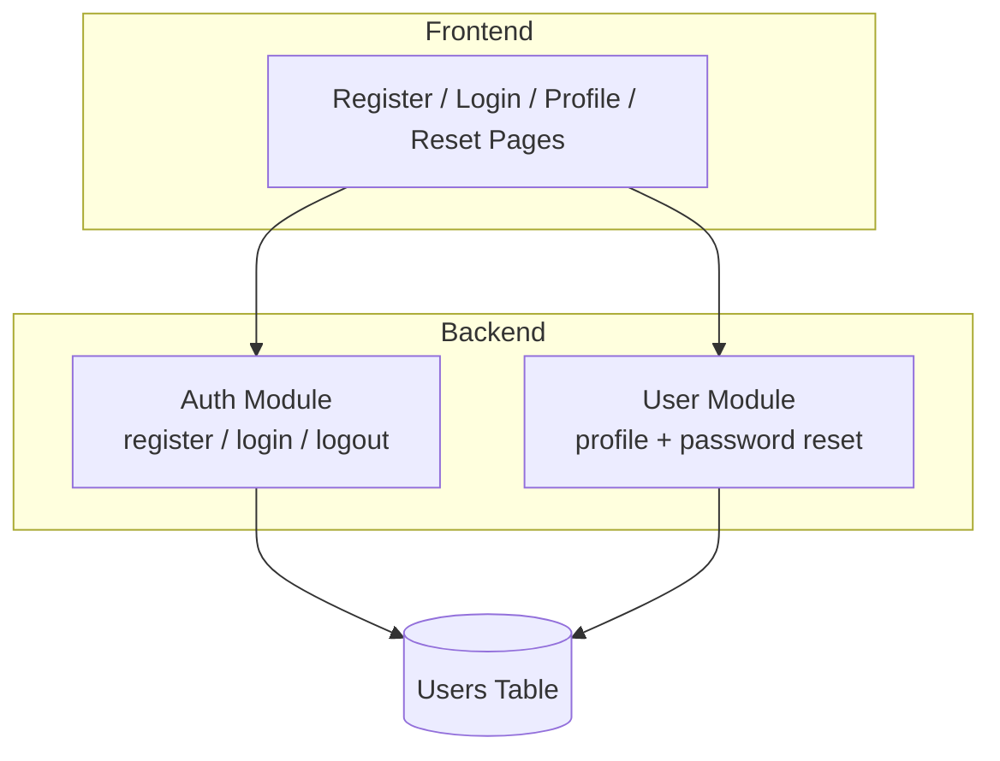
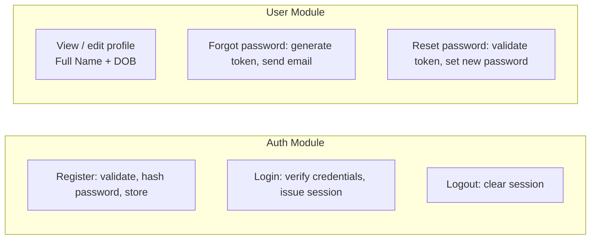
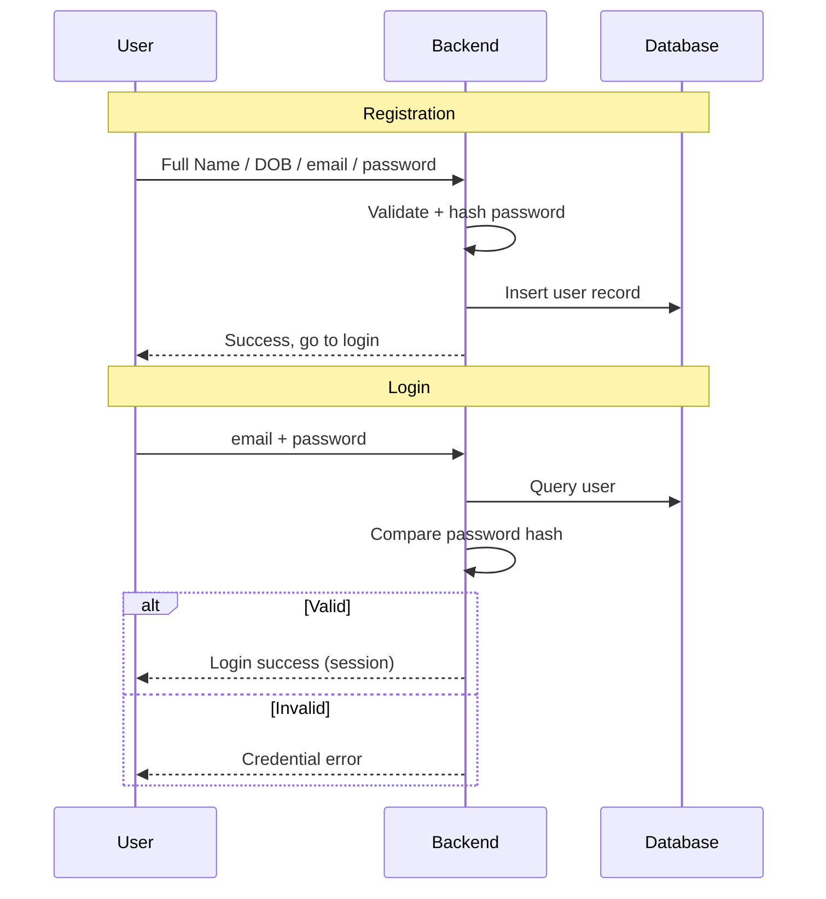
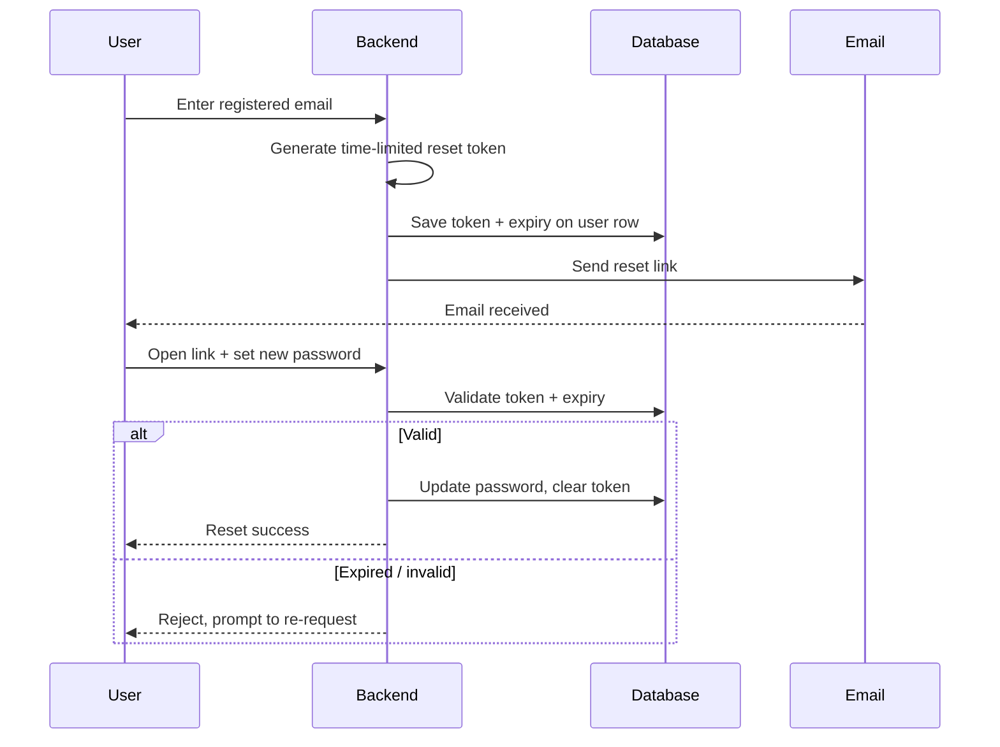
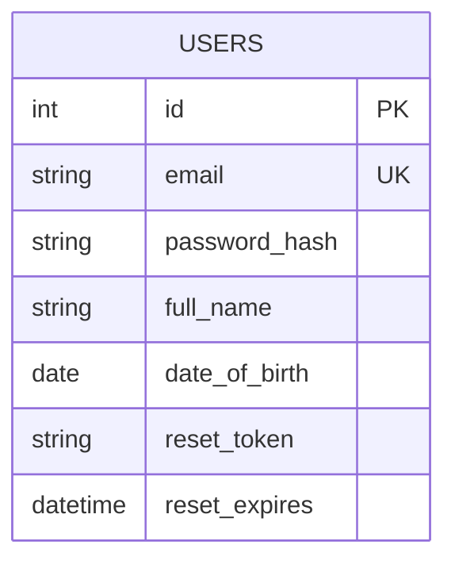

# Login / Registration System — Simplified Design Document

A minimal authentication system covering registration, login, profile management (Full Name, Date of Birth), and a "Forgot Password" flow.

## System Architecture

## Module Breakdown

## Registration & Login Flow

## Forgot Password Flow

## Data Model

## Design Principles

- **Maintainability** — Only two backend modules (Auth, User) with clear responsibilities; no redundant controller/service split.
- **Scalability** — Modules are independent, so features like two-factor auth or a separate reset-token table can be added later without restructuring.
- **Readability** — A single table and a small set of flows mean newcomers can grasp the whole system at a glance.

