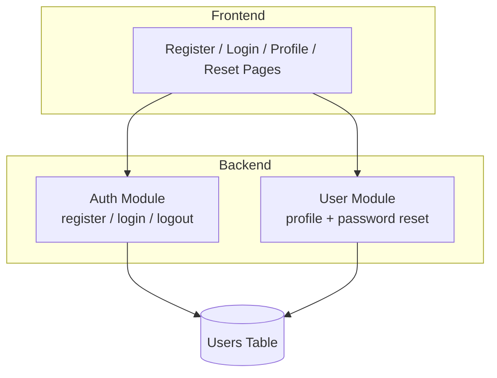
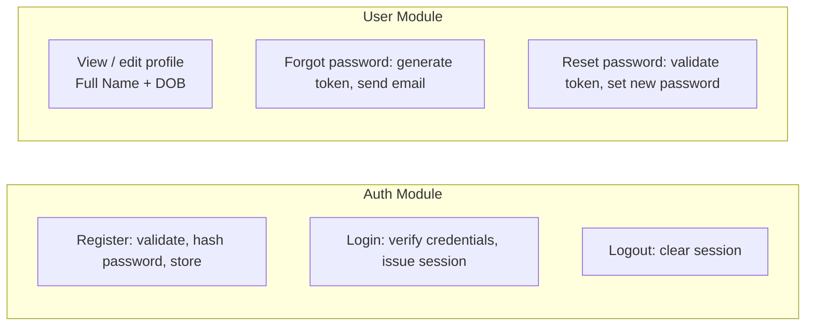
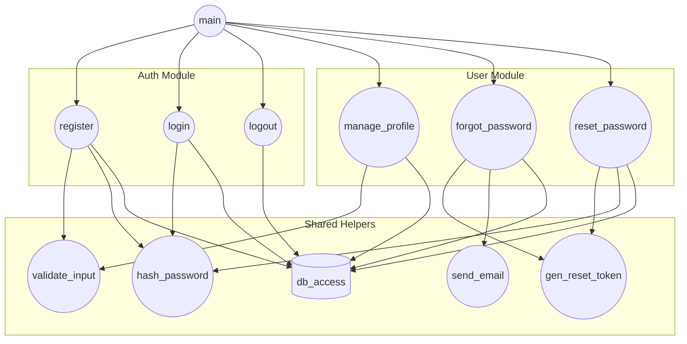
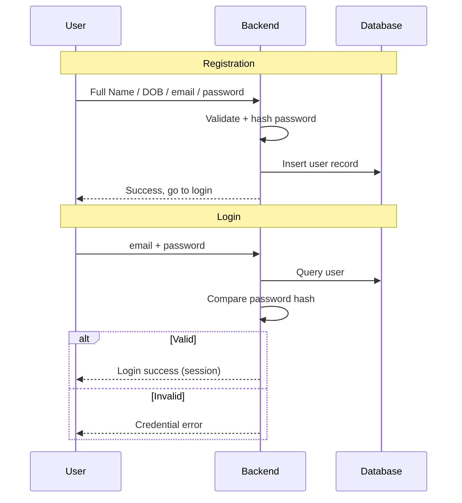
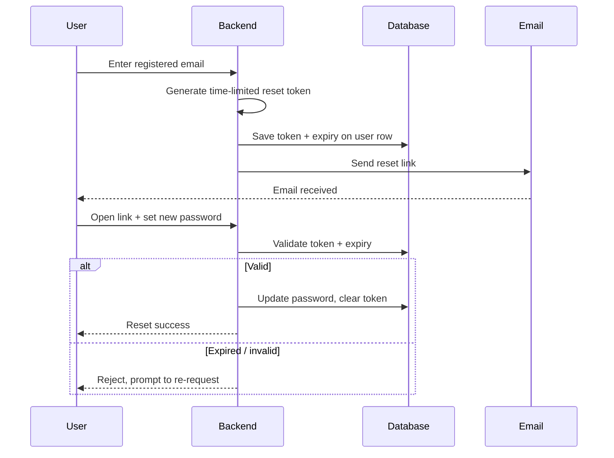
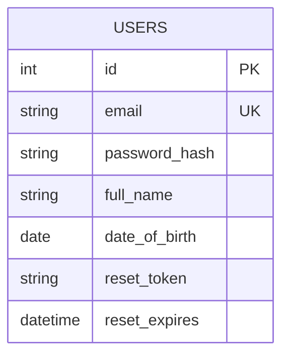

# Login / Registration System — Simplified Design Document

A minimal authentication system covering registration, login, profile management (Full Name, Date of Birth), and a "Forgot Password" flow.

## System Architecture

## Module Breakdown

## Call Graph
 

 
## Function Responsibilities
 
| Layer | Function | Responsibility |
|-------|----------|----------------|
| Entry | `main` | Application entry point, routes to all feature functions |
| Auth | `register` | Handle registration (Full Name, Date of Birth, credentials) |
| Auth | `login` | Verify credentials and issue a session |
| Auth | `logout` | Clear the active session |
| User | `manage_profile` | View and edit profile (Full Name + DOB) |
| User | `forgot_password` | Generate a reset token and send the reset email |
| User | `reset_password` | Validate token and set a new password |
| Helper | `validate_input` | Validate and sanitise user input |
| Helper | `hash_password` | Hash a plaintext password (e.g. bcrypt) |
| Helper | `gen_reset_token` | Generate a time-limited password-reset token |
| Helper | `send_email` | Send transactional email (reset link) |
| Helper | `db_access` | Unified data-access layer (insert / query / update) |

## Registration & Login Flow

## Forgot Password Flow

## Data Model

## Design Principles

- **Maintainability** — Only two backend modules (Auth, User) with clear responsibilities; no redundant controller/service split.
- **Scalability** — Modules are independent, so features like two-factor auth or a separate reset-token table can be added later without restructuring.
- **Readability** — A single table and a small set of flows mean newcomers can grasp the whole system at a glance.

