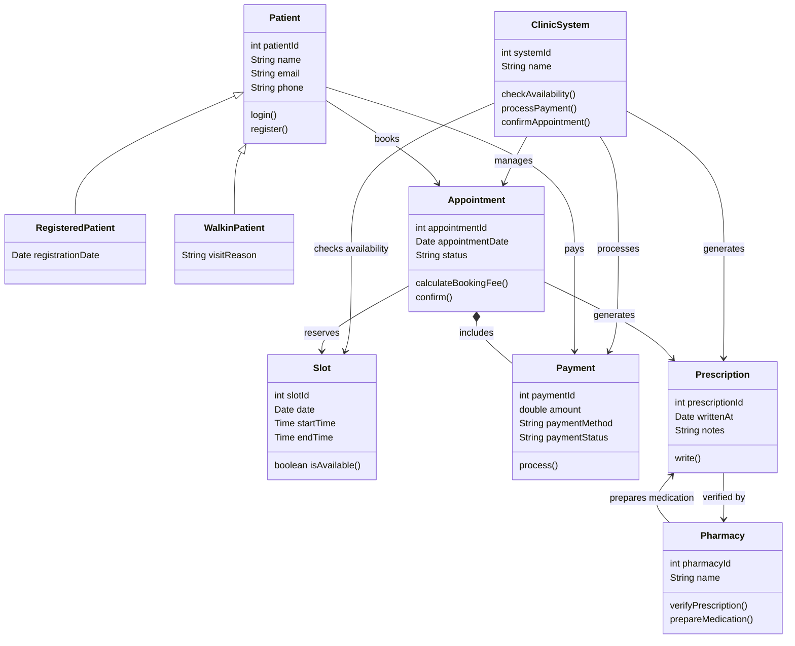

Class Diagram for a Clinic (W5-A3) project

# Patient 
A person who visits the clinic. Can log in or register, and is the base class for both registered and walk-in patients.

# ClinicSystem
The central system that manages the clinic's operations. It checks slot availability, confirms appointments, and processes payments.

# Appointment 
A booking made by a patient for a specific slot. Tracks its status, calculates the booking fee, and can be confirmed.

# Payment
Represents a financial transaction tied to an appointment, recording the amount, payment method, and current status.

