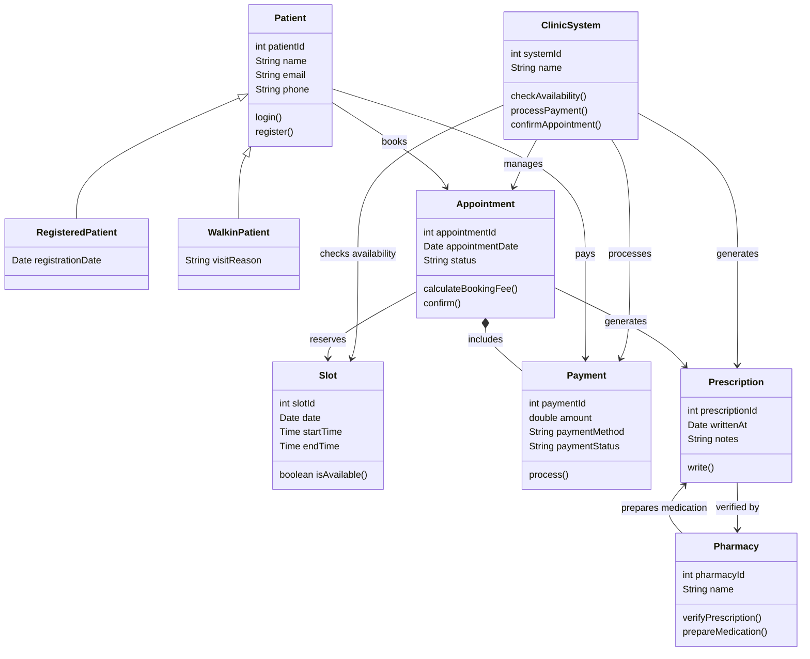

Class Diagram for a Clinic (W5-A3) project

```mermaid
classDiagram

%% =========================
%% Inheritance
%% =========================
Patient <|-- RegisteredPatient
Patient <|-- WalkinPatient

%% =========================
%% Associations
%% =========================
ClinicSystem --> Slot : checks availability
ClinicSystem --> Appointment : manages
ClinicSystem --> Payment : processes
ClinicSystem --> Prescription : generates

Patient --> Appointment : books
Patient --> Payment : pays

Appointment --> Slot : reserves
Appointment *-- Payment : includes
Appointment --> Prescription : generates

Prescription --> Pharmacy : verified by
Pharmacy --> Prescription : prepares medication

%% =========================
%% Class Definitions
%% =========================

class ClinicSystem {
    int systemId
    String name
    checkAvailability()
    processPayment()
    confirmAppointment()
}

class Patient {
    int patientId
    String name
    String email
    String phone
    login()
    register()
}

class RegisteredPatient {
    Date registrationDate
}

class WalkinPatient {
    String visitReason
}

class Pharmacy {
    int pharmacyId
    String name
    verifyPrescription()
    prepareMedication()
}

class Prescription {
    int prescriptionId
    Date writtenAt
    String notes
    write()
}

class Slot {
    int slotId
    Date date
    Time startTime
    Time endTime
    boolean isAvailable()
}

class Appointment {
    int appointmentId
    Date appointmentDate
    String status
    calculateBookingFee()
    confirm()
}

class Payment {
    int paymentId
    double amount
    String paymentMethod
    String paymentStatus
    process()
}
```