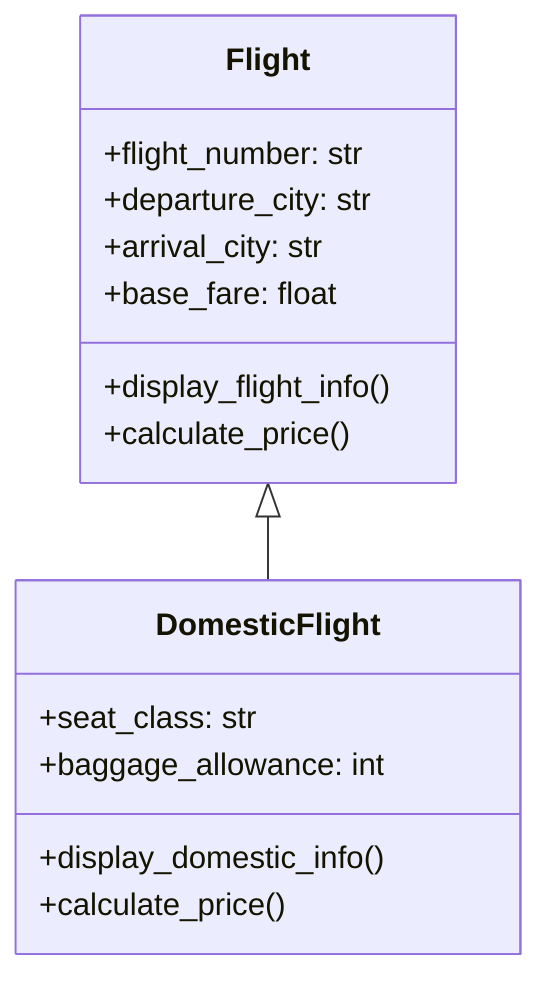

# Single inheritance

## a class diagram 

## Inheritance Relationship

* **Flight** is the parent (superclass).
* **DomesticFlight** is the child (subclass).
* **InternationalFlight** is the child (subclass).
* The subclass inherits:

  * `flight_number`
  * `departure_city`
  * `arrival_city`
  * `base_fare`
  * `display_flight_info()`
* The subclass adds:

  * `seat_class`
  * `baggage_allowance`
  * `display_domestic_info()`

* The subclass also overrides * `calculate_price()` to demonstrate polymorphism.

