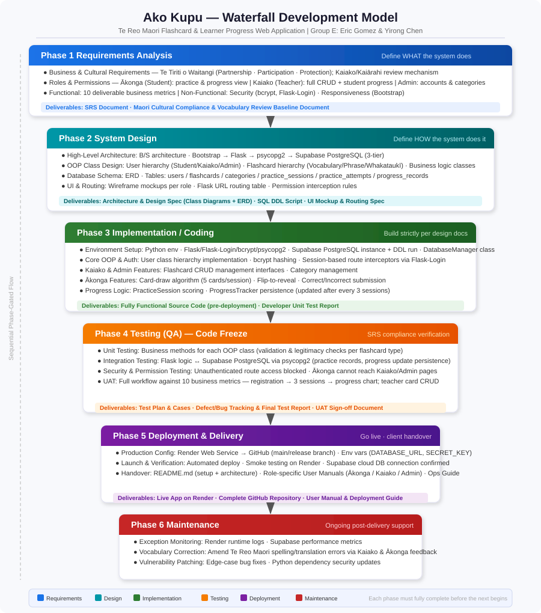

Here is the complete waterfall breakdown of the **Ako Kupu** project.

Group E: Eric Gomez & Yirong Chen

---

# Ako Kupu: A Te Reo Māori Flashcard and Learner Progress Web Application

## 1. Requirements Analysis Phase

The core objective of this phase is to establish what the system "will do," culminating in an unalterable Software Requirements Specification (SRS) document.

### 1.1 Business and Cultural Requirements Establishment

* Define the specific system manifestations that align with the three principles of **Te Tiriti o Waitangi** (Treaty of Waitangi): **Partnership, Participation, and Protection**.
* Establish a review mechanism involving **Kaiako** (Teachers) or **Kaiārahi** (Mentors/Guides) to ensure the linguistic accuracy of and cultural respect toward Te Reo Māori vocabulary, phrases, and **Whakataukī** (proverbs).

### 1.2 Roles and Permissions Definition

* **Ākonga (Students):** Register/Login, review flashcards by category, record correct/incorrect answers, and view personal progress.
* **Kaiako (Teachers):** Perform CRUD (Create, Read, Update, Delete) operations on all flashcards, manage flashcards by category, and view student progress.
* **Admin (Administrators):** User account management and baseline vocabulary category maintenance.

### 1.3 Functional Requirements

* Detail **10 deliverable business metrics** (e.g., a single practice session must contain at least 5 flashcards and be scored; progress must be updated accurately after completing 3 practice sessions, etc.).

### 1.4 Non-Functional Requirements

* **Security:** Use `bcrypt` for password hashing and implement role-based route protection via `Flask-Login`.
* **Responsiveness:** Use **Bootstrap** on the frontend to ensure cross-device adaptability (responsive design).

### Phase Deliverables

* *Ako Kupu Software Requirements Specification (SRS)*
* *Māori Cultural Compliance and Vocabulary Review Baseline Document*

---

## 2. System Design Phase

This phase addresses how the system "will do it." It is divided into high-level and detailed design. Due to the Object-Oriented Programming (OOP) approach, this phase requires high precision.

### 2.1 High-Level Architecture Design

* Determine the **B/S (Browser/Server) architecture**.
* Define the three-tier architectural relationship among the frontend (**Bootstrap**), backend (**Flask**), database driver (`psycopg2`), and cloud database (**Supabase PostgreSQL**).

### 2.2 Detailed OOP Class Design

* **User Class Inheritance Hierarchy:** Design a base class `User`, alongside derived classes `Student`, `Kaiako`, and `Admin`.
* **Flashcard Class Polymorphism Hierarchy:** Design a base class `Flashcard`, alongside derived classes `VocabularyCard`, `PhraseCard`, and `WhakataukiCard`. Define their respective content validation logic and polymorphic behaviors.
* **Business Logic Classes:** Design `VocabularyCategory`, `PracticeSession`, `PracticeAttempt`, `ProgressTracker`, and a dedicated `DatabaseManager`.

### 2.3 Database Schema Design

* Design the Entity-Relationship Diagram (ERD).
* Design table structures: `users`, `flashcards`, `categories`, `practice_sessions`, `practice_attempts`, and `progress_records`. Explicitly define primary/foreign key constraints and indexes.

### 2.4 UI & Routing Design

* Wireframe the UI Mockups for each user role's pages.
* Define the Flask routing table (URLs) along with corresponding permission interception rules.

### Phase Deliverables

* *Ako Kupu System Architecture and Detailed Design Specification (including Class Diagrams and ERD)*
* *Database Structure Definition Script (SQL DDL)*
* *UI Mockup and Routing Design Specification*

---

## 3. Implementation / Coding Phase

Code is written from the bottom up (or top down) in strict accordance with the design documentation.

### 3.1 Environment Setup and Infrastructure

* Initialize the Python project environment and configure dependencies (`Flask`, `Flask-Login`, `bcrypt`, `psycopg2`).
* Create a PostgreSQL instance on **Supabase** and run the DDL script to generate database tables.
* Write the `DatabaseManager` class to establish a stable database connection pool.

### 3.2 Core OOP Classes and Authentication Module Development

* Implement the attributes and methods of the `User` class and its subclasses.
* Combine `Flask-Login` and `bcrypt` to implement user registration, secure login, and Session-based route interceptors.

### 3.3 Business Feature Development

* Implement the Flashcard class inheritance hierarchy and polymorphic validation methods.
* Develop the backend management (CRUD) functional interfaces for **Kaiako** and **Admin**.
* Develop core frontend features for **Ākonga**: category-based card drawing algorithm (5 cards per session), flip-to-reveal answer functionality, and correct/incorrect status submission.
* Develop scoring and progress persistence logic for `PracticeSession` and `ProgressTracker`.

### Phase Deliverables

* *Fully functional Ako Kupu source code (pre-deployment)*
* *Developer Unit Test Report*

---

## 4. Testing Phase

Code freeze is enacted, and the project enters an intensive Quality Assurance (QA) phase to ensure the system is bug-free and fully compliant with the SRS.

### 4.1 Unit Testing

* Test the business methods of each OOP class (e.g., validation and legitimacy checks for different flashcard types).

### 4.2 Integration Testing

* Test the interaction between the Flask business logic layer and the Supabase PostgreSQL database to ensure data (such as practice records and progress updates) is correctly persisted via `psycopg2`.

### 4.3 Security and Permission Testing

* Verify that unauthenticated users cannot access protected routes by directly typing URLs.
* Verify that **Ākonga** cannot access **Kaiako** or **Admin** management pages.

### 4.4 User Acceptance Testing (UAT)

* Step through the complete workflow against the **10 deliverable business metrics** (from student registration, to completing 3 practice sessions, to viewing progress charts; as well as teachers adding, deleting, and modifying cards).

### Phase Deliverables

* *Ako Kupu Test Plan and Test Case Specification*
* *Defect (Bug) Tracking Report and Final Test Report*
* *User Acceptance Sign-off Document*

---

## 5. Deployment & Delivery Phase

The stable system, having passed all tests, is deployed to the production environment and formally handed over to the client/school.

### 5.1 Production Environment Configuration

* Create a Web Service on the **Render** platform and connect it to the `main` (or `release`) branch of the GitHub repository.
* Configure environment variables (`DATABASE_URL`, `SECRET_KEY`, etc.) in the Render dashboard to isolate sensitive data.

### 5.2 Final Launch and Verification

* Execute automated deployment and conduct smoke testing in the Render live production environment to ensure a successful connection to the Supabase cloud database.

### 5.3 Documentation and Handover

* Organize the `README.md` file, including a local environment setup guide and production architecture documentation.
* Write user manuals customized for **Ākonga**, **Kaiako**, and **Admin**.

### Phase Deliverables

* *Live Ako Kupu Web Application running on Render*
* *Complete GitHub Code Repository*
* *System User Manual and Deployment & Operations Guide*

---

## 6. Maintenance Phase

Daily operational support following project delivery.

### 6.1 Exception Monitoring

* Monitor Render runtime logs and Supabase database performance metrics.

### 6.2 Vocabulary Correction

* Amend any potential Te Reo Māori spelling or translation errors based on ongoing feedback from **Kaiako** or **Ākonga**.

### 6.3 Vulnerability Patching

* Fix edge-case bugs reported by users post-launch and update Python dependency packages that present security risks.