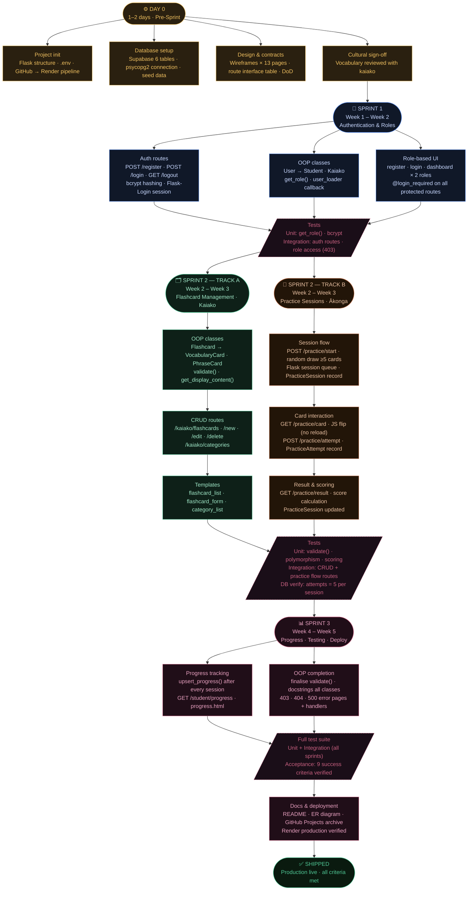

# Ako Kupu: A Te Reo Māori Flashcard and Learner Progress Web Application

Group E: Eric Gomez & Yirong Chen

Here is the complete sprints breakdown of the **Ako Kupu** project.

```mermaid
flowchart TD

    D0(["⚙️ DAY 0\n1–2 days · Pre-Sprint"])

    D0a["Project init\nFlask structure · .env · GitHub → Render pipeline"]
    D0b["Database setup\nSupabase 6 tables · psycopg2 connection · seed data"]
    D0c["Design & contracts\nWireframes × 13 pages · route interface table · DoD"]
    D0d["Cultural sign-off\nVocabulary reviewed with kaiako"]

    D0 --> D0a & D0b & D0c & D0d

    S1(["🔐 SPRINT 1\nWeek 1 – Week 2\nAuthentication & Roles"])

    S1a["Auth routes\nPOST /register · POST /login · GET /logout\nbcrypt hashing · Flask-Login session"]
    S1b["OOP classes\nUser → Student · Kaiako\nget_role() · user_loader callback"]
    S1c["Role-based UI\nregister · login · dashboard × 2 roles\n@login_required on all protected routes"]
    S1d[/"Tests\nUnit: get_role() · bcrypt\nIntegration: auth routes · role access (403)"/]

    D0d --> S1
    S1 --> S1a & S1b & S1c
    S1a & S1b & S1c --> S1d

    S2A(["🗂️ SPRINT 2 — TRACK A\nWeek 2 – Week 3\nFlashcard Management · Kaiako"])

    S2Aa["OOP classes\nFlashcard → VocabularyCard · PhraseCard\nvalidate() · get_display_content()"]
    S2Ab["CRUD routes\n/kaiako/flashcards · /new · /edit · /delete\n/kaiako/categories"]
    S2Ac["Templates\nflashcard_list · flashcard_form · category_list"]

    S2B(["🎯 SPRINT 2 — TRACK B\nWeek 2 – Week 3\nPractice Sessions · Ākonga"])

    S2Ba["Session flow\nPOST /practice/start · random draw ≥5 cards\nFlask session queue · PracticeSession record"]
    S2Bb["Card interaction\nGET /practice/card · JS flip (no reload)\nPOST /practice/attempt · PracticeAttempt record"]
    S2Bc["Result & scoring\nGET /practice/result · score calculation\nPracticeSession updated"]
    S2Bd[/"Tests\nUnit: validate() · polymorphism · scoring\nIntegration: CRUD + practice flow routes\nDB verify: attempts = 5 per session"/]

    S1d --> S2A & S2B
    S2A --> S2Aa --> S2Ab --> S2Ac
    S2B --> S2Ba --> S2Bb --> S2Bc
    S2Ac & S2Bc --> S2Bd

    S3(["📊 SPRINT 3\nWeek 4 – Week 5\nProgress · Testing · Deploy"])

    S3a["Progress tracking\nupsert_progress() after every session\nGET /student/progress · progress.html"]
    S3b["OOP completion\nfinalise validate() · docstrings all classes\n403 · 404 · 500 error pages + handlers"]
    S3c[/"Full test suite\nUnit + Integration (all sprints)\nAcceptance: 9 success criteria verified"/]
    S3d["Docs & deployment\nREADME · ER diagram · GitHub Projects archive\nRender production verified"]

    S3f(["✅ SHIPPED\nProduction live · all criteria met"])

    S2Bd --> S3
    S3 --> S3a & S3b
    S3a & S3b --> S3c --> S3d --> S3f

    classDef d0node fill:#2a2010,stroke:#f0c060,color:#f0c060
    classDef s1node fill:#101828,stroke:#5b8ef0,color:#c8d8ff
    classDef s2anode fill:#0e2018,stroke:#50c896,color:#a0e8c8
    classDef s2bnode fill:#221508,stroke:#c87850,color:#e8c0a0
    classDef s3node fill:#200e18,stroke:#c86080,color:#e8a0c0
    classDef newnode fill:#1a0e18,stroke:#c86080,color:#c86080,stroke-dasharray:4 3
    classDef done fill:#0a1a0f,stroke:#50c896,color:#50c896

    class D0,D0a,D0b,D0c,D0d d0node
    class S1,S1a,S1b,S1c s1node
    class S1d newnode
    class S2A,S2Aa,S2Ab,S2Ac s2anode
    class S2B,S2Ba,S2Bb,S2Bc s2bnode
    class S2Bd newnode
    class S3,S3a,S3b,S3d s3node
    class S3c newnode
    class S3f done
```

